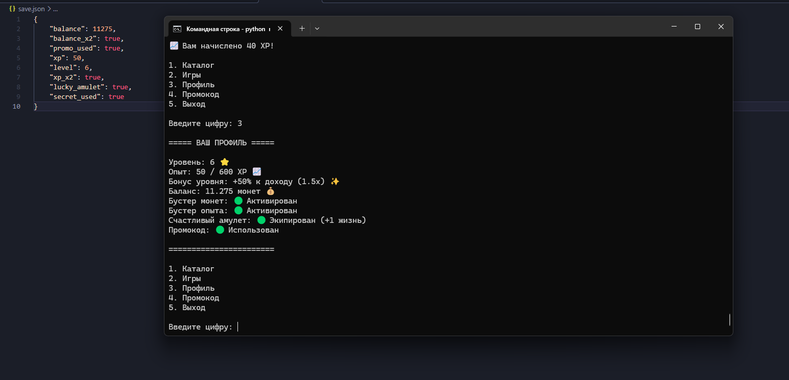

# 🎮  Мини-Магазин на Python (Версия BETA-0.3)

Добро пожаловать в крупное контентное обновление **BETA-0.3**! Проект преодолел важный рубеж в **500 строк кода**, обзавёлся продвинутой игровой математикой, новыми механиками риска, расширенным ассортиментом товаров и красивым интерфейсом.

---

## 🚀 Что нового в версии BETA-0.3:

* 🎰 **Новая игра — Игровой автомат (Слоты):** Испытайте свою удачу в настоящем казино! Вводите любую ставку и крутите три независимых барабана `[ 🍒 ] [ 💎 ] [ 👑 ]`.
  * ⚖️ *Сбалансированные шансы:* Система дюпа миллионов полностью ликвидирована! Мы прописали строгие веса для каждого символа. Выбить три вишни `"🍒"` стало вызовом (награда **2x**), три кристалла `"💎"` — редкость (награда **4x**), а сорвать легендарный **ДЖЕКПОТ 7x** на трех коронах `"👑"` — это настоящее чудо (шанс всего ~0.3%)!
* 📌 **Улучшенный интерфейс (Разделение чисел точками):** Больше никакой каши из цифр в консоли! Все крупные суммы для монет и опыта автоматически форматируются и разделяются точками (например, вместо пугающего `120500` на экране выводится аккуратное и понятное `120.500`). Читать баланс и профиль стало максимально удобно.
* ⚡ **Новый товар — Множитель опыта x2 (ID: 2):** Добавлен в магазин за 200 монет. Позволяет прокачивать уровень аккаунта в два раза быстрее, удваивая весь полученный в играх опыт!
* 📊 **Система уровней и опыта (XP):** Теперь за каждую победу и промокод вам начисляется опыт. Каждый новый уровень увеличивает ваши базовые награды в играх и промокодах на **+10% к доходу**! Накапливайте опыт и стройте свою финансовую империю.
* 🛡️ **Счастливый Амулет (ID: 3):** Новый ценный артефакт в магазине за 300 монет. Его уникальная магия навсегда дарует вам **+1 дополнительную жизнь** во всех играх (4 жизни вместо 3), защищая от случайных ошибок!
* 🔥 **Выбор сложности:** В игру «Угадай число» добавлены 3 режима сложности (Лёгкий, Средний, Сложный). Чем выше сложность, тем шире диапазон чисел (до 15, 25 и 50), но и базовые награды за победу вырастают пропорционально!
* 🗝️ **Скрытая пасхалка "666":** В главное меню встроен секретный мистический код. Тот, кто случайно введёт его, тайно получит 100 монет прямо на баланс.
* 🛡️ **Защита от уязвимостей и багов:** Реализована надёжная защита от дюпа (повторного использования) пасхалки через переменную `secret_used`. Все данные JSON синхронизированы и защищены от вылетов при первом запуске.

---

## ✨ Актуальные особенности проекта



* 💾 **Продвинутая база данных (save.json):** Автоматическое сохранение баланса...
* 👤 **Информативный Профиль:** Удобное меню со всеми характеристиками...
* 🛒 **Внутриигровой Магазин:** Покупайте множитель монет x2...
* 🔑 **Прогрессивная система промокодов:** Награда за секретный код...

---

## 🗺️ Планы на будущее (Версия 0.4)
* 📦 **Полноценная система Инвентаря:** Отображение всех купленных вещей в виде списка в профиле и механика их перепродажи обратно в магазин за полцены.
* ⚙️ **Новые предметы пассивного дохода:** Добавление предметов («Бизнес» или «Майнинг-ферма») с возможностью постепенной прокачки их уровней!
* 🎨 **Цветной интерфейс:** Интеграция библиотеки для раскрашивания текста в консоли (зелёный для побед, красный для ошибок).

---

## 📦 Инструкция по запуску
1. Скачайте файлы `mini_store.py` и `mini_store_shop.txt` в одну папку.
2. Запустите игру через терминал:
```bash
python mini_store.py
```

---
❤️ *Спасибо, что остаётесь с нами! Проект развивается и растёт с каждым днём.*
