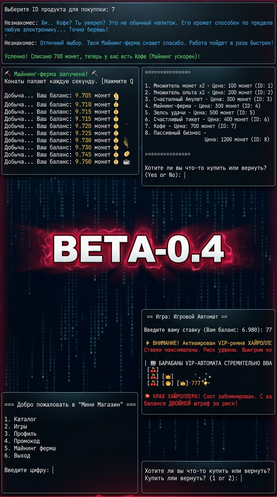

  

# 🎰 Mini-Store RPG Game v1.0 (Релиз патча BETA-0.4)

**Mini-Store** — это масштабная текстовая консольная RPG-игра на Python с продвинутой экономической системой, азартными играми, прокачкой аккаунта и двумя независимыми видами пассивного дохода. Проект полностью написан на чистом Python и скомпилирован в монолитный `.exe` файл для работы на любой Windows без установки дополнительных программ.

Кодовая база проекта официально перешагнула отметку в **1000+ строк кода**!

---

## 🔥 Что нового в легендарном обновлении BETA-0.4

### 🎨 1. Цветовая палитра консоли (ANSI)
Интерфейс игры стал визуально понятным благодаря глубокой раскраске:
* **Красный цвет:** для сообщений об ошибках, нехватке монет и проигрышах.
* **Зелёный цвет:** для триумфальных побед, левелапов и успешных покупок.
* **Жёлтый цвет:** для вывода золота, красивого оформления рамок и важной статистики.
* **Синий цвет:** уникальный цвет для реплик и диалогов таинственного Незнакомца.

### 🏪 2. Расширение Каталога (5 новых товаров)
В магазин Незнакомца добавлены крупные economic- и геймплейные бустеры:
* **Майнинг-ферма (300 монет):** Открывает доступ к пассивному заработку в реальном времени.
* **Зелье удачи (500 монет):** Повышает шансы в казино и увеличивает шанс критического удара.
* **Счастливый Тикет (400 монет):** Защитный оберег от проигрыша в играх.
* **Кофе (700 монет):** Турбо-разгон для кулеров Майнинг-фермы.
* **Пассивный бизнес (1200 монет):** Самый дорогой VIP-товар для генерации монет в меню.

### ⚔️ 3. Универсальный Счастливый Тикет и Криты в играх
* **Защита от фиаско:** Если у вас куплен Счастливый Тикет, он автоматически спасет вас от **1 проигрыша** в играх «Угадай число» (на любой сложности) и «Камень, ножницы, бумага». Жизнь возвращается, а билет сгорает.
* **Механика Критического Удара:** При победе в этих играх награда монет и опыта может умножиться на **2x**. По умолчанию шанс крита составляет **15%**, но если у вас с собой **Зелье Удачи**, шанс возрастает до **35%**!

### 🎰 4. Залипательные Слоты и VIP-ставка «777»
* В Игровой Автомат добавлена плавная анимация вращения барабанов через задержку времени `time.sleep(0.4)`.
* **Режим Хайроллера:** Если сделать ставку ровно в **777 монет**, активируется скрытый хардкорный режим. При выпадении трех символов в ряд без ошибок сумма награды и опыта бешено умножается! Но если комбинация окажется пустой, защита не сработает и с баланса вычтется **в два раза больше монет** (проверка на баланс перед ставкой присутствует).

### ⛏️ 5. Майнинг-Ферма и Разгон от Кофе (Пункт 5)
* Главное меню перестроено: кнопка «Выход» сместилась на **6**, а под цифрой **5** открывается экран Майнинг-фермы. Если ферма не куплена, Незнакомец отправит вас в каталог.
* **Прокачка железа:** Ферма имеет 10 уровней. Покупка 1-го уровня стоит 300 монет, а максимальная прокачка до **10 LVL обойдется в 3000 монет**.
* **Турбо-режим:** По умолчанию ферма копает монеты раз в 1.0 секунду. Но если вы купили **Кофе**, задержка падает до **0.5 секунды** — строки добычи летят в два раза быстрее!
* **Управление и автосохранение:** Для выхода в меню нужно нажать клавишу `Q` (если вы на русской раскладке, игра попросит переключиться на английскую). Внутри майнинга работает ежесекундное автосохранение в JSON для защиты от отключения света.

### 💼 6. Пассивный Бизнес (Доход за каждый ход)
* Купив IT-Стартап за 1200 монет, вы получаете пошаговый доход. Каждый раз, когда вы совершаете любое действие в меню (например, ввели `3`, чтобы проверить Профиль), игра в фоне начисляет вам **+25 монет за ход**.

### 🔄 7. Система возврата товаров Незнакомцу за полцены
* В магазине появился пункт возврата. Вы можете сдать купленный товар обратно за **50% от его стоимости** (например, сдать Амулет за 150 монет). 
* Чтобы вернуть вещь, нужно пройти проверку наличия товара и ввести команду строго в формате: `Yes` -> `2` (выбор возврата, где 1 — покупка) -> `ID товара`.
* **Пасхалка/Ограничение:** При попытке вернуть Майнинг-ферму (ID: 4), Незнакомец заблокирует действие и скажет, что эта фича откроется только в **BETA-0.5**.

### 🕵️ 8. Характер Незнакомца и наказание за спам (ID: 2)
* Торговец запоминает ваши действия через переменную `bought`. Если вы попытаетесь повторно купить уже активированный Множитель опыта x2 (ID: 2), Незнакомец на 3-й раз сделает вам строгое предупреждение. На 5-й раз он проявит щедрость и подкинет **100 монет**, но если вы наглеете и кликаете в 6-й раз — он жёстко оштрафует вас и **заберет 100 монет обратно**.

---

## 📦 Инструкция по запуску игры (.exe)

Игра полностью автономна и не требует установленного Python на вашем компьютере:

1. **Создайте отдельную пустую папку** в любом удобном месте на вашем ПК.
2. Перейдите в раздел **Releases** (Релизы) на главной странице этого репозитория на GitHub и скачайте актуальный файл **`mini_store.exe`**.
3. Закиньте скачанный файл `mini_store.exe` в ранее созданную вами пустую папку.
4. Запустите файл двойным кликом. 
5. **Важно:** При первом запуске Windows может выдать стандартное предупреждение системы безопасности (Защитник/SmartScreen). Разрешите запуск (нажмите *«Подробнее» -> «Выполнить в любом случае»*). Это **не вирус**, а чистый исполняемый скрипт игры. Вы всегда можете прочесть открытый исходный код `mini_store.py` прямо в этом репозитории, чтобы убедиться, что внутри него!
6. Игра автоматически сгенерирует файлы базы данных `save.json` (содержит **15 параметров**) и каталог `mini_store_shop.txt` в этой же папке.

---

## 🎯 Планы на будущее (Версия BETA-0.5)

Поскольку в BETA-0.4 было добавлено на 5 пунктов больше, чем планировалось изначально, глобальные и сложные механики переносятся в следующий масштабный патч:

* 🃟 **Расширение Казино (Новая игра):** Интеграция полноценной карточной игры **Блекджек (21 очко)** или классической **Рулетки** (Красное/Чёрное/Зеро) со своими множителями, VIP-ставками и поддержкой Зелья Удачи.
* 📈 **Продвинутая система Инвентаря:** Перенос отображения купленных вещей из обычного текстового статуса в полноценный графический/текстовый список внутри Профиля с возможностью кастомизации.
* 🔄 **Сюжетный выкуп Майнинг-фермы:** Реализация заблокированной в текущей версии механики. В BETA-0.5 игрок сможет официально вернуть Майнинг-ферму обратно Незнакомцу, но для этого придётся выполнить его особое условие или столкнуться с новыми штрафами!
* ⚙️ **Глобальный баланс и защита данных:** Масштабирование JSON-базы данных под новые предметы без потери старых сохранений `save.json`.
* 🔄 **Сброс прогресса (Hard Reset):** Интеграция функции полной очистки базы данных. Игрок сможет в любой момент обнулить свои 14+ параметров и удалить файл `save.json` прямо из меню игры, чтобы начать свой путь в Mini-Store с чистого листа.
